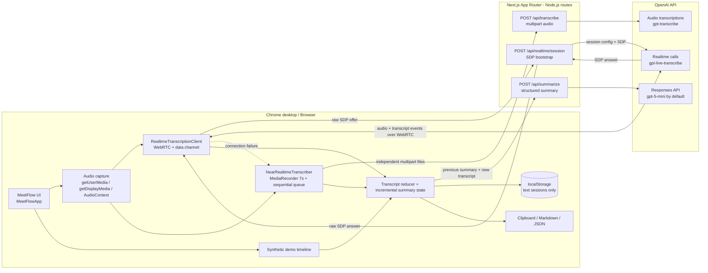

# MeetFlow AI

MeetFlow AI là MVP trợ lý biên bản cuộc họp bằng tiếng Việt. Ứng dụng thu âm từ microphone, âm thanh màn hình hoặc nguồn trộn; hiển thị transcript; tạo tóm tắt có cấu trúc gồm ý chính, quyết định, action item và câu hỏi mở; sau đó lưu văn bản trong trình duyệt để xem lại hoặc export.

> **Phạm vi xác minh:** tài liệu này mô tả code đang có trong thư mục `codebase`. Các test tự động hiện tại không gọi OpenAI thật và không thay thế kiểm thử trình duyệt. Tài liệu không khẳng định API live hay một deployment Vercel đã được chạy thành công.

## Tính năng hiện có

- Ba nguồn âm thanh: microphone, âm thanh màn hình, hoặc microphone + màn hình.
- OpenAI Realtime transcription qua WebRTC, hỗ trợ transcript delta và completed.
- Tự chuyển sang near real-time khi kết nối Realtime ban đầu thất bại hoặc bị ngắt sau khi đã kết nối.
- Near real-time ghi từng file độc lập khoảng 7 giây và upload tuần tự.
- Tóm tắt tăng dần bằng OpenAI Responses API với output được kiểm tra bằng Zod.
- Demo transcript tổng hợp, không cần microphone.
- Pause/resume, kết thúc phiên, tìm/copy transcript và sửa hoặc xóa decision/action item.
- Lịch sử tối đa 100 phiên trong `localStorage`; đổi tên và xóa từng phiên.
- Export Markdown, JSON và copy biên bản.
- Light/dark theme và giao diện responsive.

Không nằm trong MVP hiện tại: tài khoản người dùng, database server, đồng bộ nhiều thiết bị, diarization người nói, lưu/phát lại recording, bot tự tham gia Zoom/Meet/Teams, calendar integration và browser E2E test.

## Real, demo và mock khác nhau thế nào?

| Nhánh | Nguồn transcript | Nguồn summary | Có dùng microphone/system audio? | Có gọi OpenAI? |
|---|---|---|---|---|
| Realtime | Audio thật qua WebRTC, model `gpt-live-transcribe` | Responses API | Có | Có |
| Near real-time | Audio thật, mỗi file MediaRecorder 6–8 giây, mặc định 7 giây; model `gpt-transcribe` | Responses API | Có | Có |
| Demo khi chưa có API key | Transcript tổng hợp chạy theo timeline | Mock summary được gắn nhãn rõ | Không | Không |
| Demo khi có API key | Transcript vẫn là dữ liệu tổng hợp | Mock được tạo theo timeline; auto/manual refresh có thể gọi `/api/summarize` và đổi provenance thành `AI thật` | Không | Có thể có, nhưng chỉ với transcript tổng hợp |

Nút ghi âm thật bị khóa khi server không có `OPENAI_API_KEY`. Demo vẫn hoạt động trong trường hợp này.

## Kiến trúc

Stack hiện tại: Next.js 16.2.12, React 19.2.8, TypeScript 5.9 strict, Tailwind CSS 4.3, OpenAI SDK 7.1, Zod 4.4 và Vitest 4.1. UI dùng component/CSS của repo, không phụ thuộc shadcn/ui.



### Bản đồ code

| Khu vực | File chính | Vai trò |
|---|---|---|
| Điều phối UI | `src/components/meetflow-app.tsx` | Vòng đời phiên, fallback, autosave, summary và export |
| Capture | `src/lib/audio-capture.ts` | Mic, display audio và trộn hai nguồn bằng Web Audio API |
| Realtime client | `src/lib/realtime-client.ts` | SDP, peer connection, data channel, pause/resume và cleanup |
| Near real-time | `src/lib/near-realtime.ts` | File MediaRecorder độc lập, queue upload tuần tự và retry |
| Transcript | `src/lib/transcript.ts` | Ghép delta, hoàn tất, chống trùng và giữ thứ tự segment |
| Summary | `src/lib/summary.ts`, `src/lib/meeting-schema.ts` | Payload tăng dần, trigger và schema dữ liệu |
| Persistence/export | `src/lib/storage.ts`, `src/lib/export.ts` | `localStorage`, Markdown, JSON và download |
| OpenAI server boundary | `src/app/api/**/route.ts`, `src/lib/server/openai.ts` | Giữ API key ở server, giới hạn request, timeout và lỗi an toàn |

## Luồng OpenAI và fallback

### Realtime transcription

1. Người dùng chọn nguồn âm thanh và xác nhận mọi người tham gia đã đồng ý ghi âm.
2. Browser chỉ lấy các audio track cần thiết. Với screen share, browser vẫn yêu cầu một video track để mở picker, nhưng ứng dụng không hiển thị hay gửi video đó tới OpenAI.
3. Client tạo SDP offer rồi gửi dạng `application/sdp` tới `POST /api/realtime/session`.
4. Route kiểm tra kích thước/định dạng SDP, thêm cấu hình transcription tiếng Việt + tiếng Anh, server VAD và gửi handshake tới `https://api.openai.com/v1/realtime/calls`.
5. Sau khi cài SDP answer, audio đi qua peer WebRTC giữa browser và OpenAI; route Next.js không proxy luồng media liên tục.
6. Data channel trả về các sự kiện delta/completed. Client dùng khóa ổn định `${item_id}:${content_index}` để ghép và chống trùng transcript.

### Near real-time fallback

Fallback được kích hoạt tự động khi kết nối Realtime ban đầu không thành công, hoặc khi peer/data channel gặp lỗi sau khi kết nối. Luồng capture hiện tại được tái sử dụng:

1. Mỗi `MediaRecorder` tạo một file hoàn chỉnh, độc lập, dài từ 6 đến 8 giây; mặc định là 7 giây.
2. Các Blob chỉ nằm tạm trong queue bộ nhớ và được gửi **tuần tự** dưới dạng `multipart/form-data` tới `POST /api/transcribe`.
3. Route chấp nhận trường `file`, giới hạn audio 8 MB, chuẩn hóa định dạng và gọi model `gpt-transcribe`.
4. Text hoàn tất được nối vào transcript. Một request lỗi được retry một lần theo cấu hình mặc định; lỗi của chunk được báo qua UI mà không lưu file audio.
5. Khi kết thúc phiên, chunk cuối được flush trước khi stream capture bị dừng.

Near real-time có độ trễ tối thiểu bằng độ dài chunk cộng thời gian mạng/model. Đây là fallback về độ bền, không phải Realtime tương đương về latency.

> Thiếu system audio không tự đổi sang microphone. UI trả lỗi để người dùng chủ động chọn lại nguồn, tránh âm thầm ghi sai nguồn.

### Structured summary

- Client gửi `previousSummary` cùng **phần transcript mới** tới `POST /api/summarize`.
- Scheduler kiểm tra mỗi 5 giây, giữ khoảng cách tối thiểu 30 giây, rồi yêu cầu summary khi transcript mới đạt 280 ký tự hoặc đã qua 45 giây; người dùng vẫn có thể cập nhật thủ công.
- Route dùng Responses API, mặc định `gpt-5-mini`, `store: false` và structured output được xác thực bằng Zod.
- Prompt yêu cầu không bịa quyết định, chỉ ghi owner/deadline khi được nói rõ, giữ bằng chứng cho quyết định và đưa phần chưa rõ vào câu hỏi mở.
- Khi live summary lỗi, UI giữ dữ liệu hiện có và báo lỗi; live mode không âm thầm thay bằng mock.

## Privacy và ranh giới dữ liệu

- Consent checkbox là bắt buộc trước khi nút ghi thật được bật. Người vận hành vẫn chịu trách nhiệm tuân thủ quy định và nhận đồng thuận phù hợp.
- `OPENAI_API_KEY` chỉ được đọc trong server routes; không dùng biến `NEXT_PUBLIC_` cho secret.
- Code ứng dụng không có database/object storage và không ghi raw audio/video vào `localStorage` hay file export.
- Realtime audio được OpenAI xử lý qua WebRTC. Fallback audio đi qua route `/api/transcribe` rồi tới OpenAI. Transcript/summary được gửi tới `/api/summarize` khi dùng AI thật.
- Blob fallback chỉ được giữ tạm trong memory queue. Route transcription đọc file vào bộ nhớ để gọi API rồi không persist file.
- `/api/summarize` đặt `store: false`; các route trả `Cache-Control: no-store` và không trả upstream error body, transcript hay stack trace trong lỗi.
- Chính sách lưu giữ/xử lý của hạ tầng triển khai và OpenAI nằm ngoài cơ chế persistence của repo này; cần kiểm tra chính sách tài khoản/provider trước khi dùng dữ liệu nhạy cảm.
- Transcript, summary và metadata phiên được lưu dưới key `meetflow.sessions.v1` trong `localStorage` của origin hiện tại. Dữ liệu này không được mã hóa, không đồng bộ thiết bị và có thể đọc bởi người khác dùng cùng browser profile.
- File Markdown/JSON đã tải xuống chứa nội dung cuộc họp. Hãy xử lý các file đó như dữ liệu nhạy cảm dù chúng không chứa audio/video.
- Security headers hiện tại chặn iframe, hạn chế referrer, tắt camera và chỉ cho microphone/display capture từ cùng origin.
- Ba POST route chặn browser request cross-site/mismatched Origin và có limiter theo IP trên từng warm process để giảm lạm dụng key. Đây là lớp bảo vệ best-effort, không thay thế rate limit dùng shared store.

## Yêu cầu

- Node.js `>=20.9.0`.
- pnpm `10.5.2` (khai báo trong `package.json`).
- Chrome desktop được khuyến nghị cho luồng ghi âm thật.
- `localhost` hoặc HTTPS để browser cho phép media capture.
- OpenAI API key cho transcription/summary thật. Demo không bắt buộc key.

## Cài đặt local

Từ root của repository:

```powershell
cd codebase
corepack enable
corepack prepare pnpm@10.5.2 --activate
pnpm install
Copy-Item .env.example .env.local
```

Điền `.env.local`:

```dotenv
# Bắt buộc cho Realtime, near real-time transcription và AI summary.
OPENAI_API_KEY=your_openai_api_key

# Tùy chọn; mặc định là gpt-5-mini.
OPENAI_SUMMARY_MODEL=gpt-5-mini
```

Không commit `.env.local`. Repo đã ignore `.env*`, ngoại trừ `.env.example`. Sau khi thêm hoặc đổi API key, hãy restart dev server vì `aiConfigured` được tính ở server khi render trang.

Chạy ứng dụng:

```powershell
pnpm dev
```

Mở `http://localhost:3000`. Có thể bấm **Dùng dữ liệu mô phỏng** để kiểm tra UI trước khi cấu hình OpenAI hoặc cấp quyền microphone.

## Commands

| Command | Mục đích |
|---|---|
| `pnpm dev` | Chạy Next.js development server |
| `pnpm build` | Tạo production build |
| `pnpm start` | Chạy production build đã tạo |
| `pnpm lint` | Chạy ESLint với Next.js Core Web Vitals + TypeScript rules |
| `pnpm typecheck` | Chạy TypeScript strict check, không emit |
| `pnpm test` | Chạy toàn bộ Vitest một lần |
| `pnpm test:watch` | Chạy Vitest watch mode |

Release gate local đề nghị:

```powershell
pnpm lint
pnpm typecheck
pnpm test
pnpm build
```

Các command trên là hướng dẫn chạy; README này không ghi nhận chúng như kết quả đã chạy trong một môi trường cụ thể.

## Cách dùng

1. Chọn **Bắt đầu cuộc họp**.
2. Đặt tên, chọn nguồn và xác nhận consent.
3. Với **Âm thanh màn hình** hoặc **Microphone + màn hình**, chọn tab/màn hình có audio trong picker và bật tùy chọn chia sẻ audio nếu Chrome hiển thị.
4. Theo dõi badge mode. `Near real-time mode` nghĩa là fallback đang hoạt động.
5. Pause/resume khi cần. Kết thúc phiên để flush chunk cuối, dừng track và lưu phiên.
6. Sửa decision/action item trực tiếp; dữ liệu được autosave vào browser.
7. Copy hoặc export Markdown/JSON. Phiên cũ có thể mở lại ở chế độ read-only, đổi tên hoặc xóa.

## Giới hạn Chrome desktop và system audio

- Media capture chỉ hoạt động trong secure context: HTTPS hoặc `localhost`.
- Khả năng capture system audio phụ thuộc Chrome, hệ điều hành và loại surface được chọn. Một tab Chrome có audio thường đáng tin cậy hơn một cửa sổ ứng dụng; không phải cửa sổ/màn hình nào cũng cung cấp audio track.
- Chỉ khi picker hiển thị và người dùng bật **Chia sẻ âm thanh** thì app mới nhận được display audio. Nếu không có audio track, app báo lỗi `NO_SYSTEM_AUDIO` và yêu cầu chọn lại hoặc dùng microphone.
- `getDisplayMedia` luôn mở browser picker và cần thao tác người dùng; app không thể tự chọn tab hay bỏ qua quyền.
- Code yêu cầu `video: true` để sử dụng screen-share picker, nhưng chỉ audio track được đưa vào transcription. Video track cũng được dùng để phát hiện khi người dùng bấm dừng chia sẻ.
- Mode **Microphone + màn hình** cần cả hai quyền và một `AudioContext` đang chạy. Nếu browser suspend AudioContext, việc trộn nguồn sẽ không bắt đầu.
- Khi người dùng dừng screen share từ thanh điều khiển của Chrome, phiên hiện tại tự kết thúc và lưu phần text đã có.
- Nên dùng tai nghe khi trộn mic + âm thanh cuộc họp để giảm echo. App không tự phát lại stream trộn ra loa.
- Safari/Firefox/mobile chưa có browser E2E coverage trong repo; không nên xem chúng là môi trường được xác nhận.

## Known limitations

- System audio phụ thuộc Chrome, hệ điều hành và nguồn được chọn trong share picker; prototype chỉ tối ưu cho Chrome desktop.
- Speaker diarization chưa được hỗ trợ đầy đủ. MeetFlow không tự suy ra người phụ trách từ giọng nói hoặc đại từ mơ hồ.
- Phiên họp chỉ lưu trong `localStorage` của một browser/origin, không đồng bộ sang thiết bị hay thành viên khác.
- MVP không lưu audio/video và không thể phát lại recording.
- Đây không phải bot Zoom/Google Meet/Microsoft Teams và không tự tham gia phòng họp.
- Limiter API hiện chỉ tồn tại trong từng warm Node.js process, reset khi cold start/deploy và không chia sẻ giữa các Vercel instance. Production cần limiter dùng KV/Redis/WAF, ngân sách OpenAI và cấu hình IP proxy đáng tin cậy.

## Lưu trữ và export

| Dữ liệu | Nơi tồn tại | Giới hạn/hành vi |
|---|---|---|
| Raw audio/video | MediaStream/Blob tạm trong memory | Không persist; bị dừng/xả khi kết thúc hoặc cleanup |
| Transcript + summary + metadata | `localStorage` của browser/origin | Tối đa 100 phiên, schema-validated; dữ liệu hỏng trả về lịch sử rỗng |
| Theme | `localStorage` key `meetflow.theme` | Theo browser profile |
| Markdown export | File tải xuống | Biên bản dễ đọc, gồm transcript nhưng không có media |
| JSON export | File tải xuống | Toàn bộ `MeetingSession`, không có media |
| Clipboard | Clipboard của hệ điều hành | Copy transcript hoặc biên bản theo quyền browser |

Xóa một phiên trong UI là thao tác không thể hoàn tác. Để xóa toàn bộ lịch sử của origin, xóa site data trong browser hoặc xóa key `meetflow.sessions.v1` bằng DevTools.

## Deploy lên Vercel

### Dashboard/Git integration

1. Import repository vào Vercel.
2. Trong Project Settings, đặt **Root Directory** chính xác là `codebase`.
3. Giữ framework là Next.js. Vercel sẽ đọc `packageManager: pnpm@10.5.2`, Node engine và các script trong `package.json`.
4. Thêm `OPENAI_API_KEY` dưới dạng secret cho đúng scope cần dùng: Preview, Production và/hoặc Development.
5. Tùy chọn thêm `OPENAI_SUMMARY_MODEL`. Không thêm prefix `NEXT_PUBLIC_` cho bất kỳ secret nào.
6. Tạo Preview deployment trước, chạy test matrix bên dưới, rồi mới promote/deploy Production.
7. Sau khi thay đổi env, tạo deployment mới hoặc redeploy; deployment cũ không tự nhận giá trị mới.

Nếu dùng Vercel CLI đã được cài đặt:

```powershell
# Chạy từ repository root; --cwd giúp link đúng Next.js app.
vercel link --cwd codebase
vercel env add OPENAI_API_KEY --cwd codebase
vercel env add OPENAI_SUMMARY_MODEL --cwd codebase

# Preview trước.
vercel deploy --cwd codebase

# Chỉ chạy sau khi preview đã được kiểm tra.
vercel deploy --prod --cwd codebase
```

Chọn đúng scope khi CLI hỏi. Không đặt token/API key trực tiếp trong command history hay commit `.vercel`; thư mục này đã được ignore. Vercel cung cấp HTTPS, cần thiết cho media capture, nhưng vẫn phải kiểm tra quyền và audio picker bằng Chrome desktop trên URL Preview.

## Troubleshooting

| Triệu chứng | Nguyên nhân thường gặp | Cách kiểm tra/xử lý |
|---|---|---|
| Nút ghi thật bị khóa | Server không thấy `OPENAI_API_KEY` | Kiểm tra `.env.local`, không dùng `NEXT_PUBLIC_`, rồi restart `pnpm dev` |
| Local có key nhưng Vercel vẫn báo chưa cấu hình | Env sai project/scope hoặc deployment được tạo trước khi thêm env | Kiểm tra Project Settings, thêm vào Preview/Production phù hợp và redeploy |
| Browser từ chối microphone/screen share | Quyền site hoặc quyền hệ điều hành bị chặn; trang không dùng HTTPS/localhost | Mở Site settings, quyền Privacy của OS, rồi thử lại trên Chrome desktop |
| Chia sẻ màn hình nhưng báo không có audio | Surface không cung cấp audio hoặc chưa bật Chia sẻ âm thanh | Chọn tab có phát audio; nếu vẫn không có, chọn chế độ microphone |
| Mode trộn không bắt đầu | Thiếu một trong hai quyền hoặc AudioContext bị suspend | Thử lại từ click người dùng; kiểm tra mic trước, sau đó picker display audio |
| Badge chuyển sang Near real-time | Realtime handshake/peer/data channel lỗi, rate limit hoặc mạng chặn WebRTC | Kiểm tra server logs và API key. Fallback là hành vi dự kiến; transcript sẽ có độ trễ theo chunk |
| Near real-time không ra text | MediaRecorder/MIME không được hỗ trợ, `/api/transcribe` lỗi hoặc mạng gián đoạn | Dùng Chrome desktop, xem Network/route logs; mỗi audio file phải nhỏ hơn 8 MB |
| Summary không cập nhật | Chưa có transcript mới, request đang chạy, model/key/rate limit lỗi | Bấm Cập nhật sau khi có transcript; kiểm tra `/api/summarize` và server logs |
| Lịch sử biến mất | Khác origin/browser profile, incognito, site data bị xóa hoặc JSON cũ không qua schema | Quay lại đúng origin/profile; kiểm tra key `meetflow.sessions.v1` |
| Copy/download không chạy | Clipboard/download bị browser chặn | Cấp quyền clipboard hoặc dùng nút export sau thao tác người dùng |
| Vercel báo không tìm thấy Next.js/package | Root Directory đang trỏ vào repository root | Đặt Root Directory thành `codebase`, sau đó redeploy |
| WebRTC bị chặn trong mạng công ty | Firewall/proxy chặn media transport | Thử mạng khác; xác nhận app tự chuyển near real-time qua HTTPS |

API routes cố ý trả thông báo an toàn thay vì upstream body. Khi debug server, dùng status/code trả về và platform logs; không log API key, transcript hay raw audio.

## Test matrix

### Automated unit tests hiện có

Các test chạy trong Vitest `node` environment, dùng fake/memory implementations và không gọi OpenAI thật.

| File | Coverage chính |
|---|---|
| `tests/realtime-client.test.ts` | Raw SDP, event order/failed, stable key, delta/completed, pause/resume và cleanup idempotent |
| `tests/near-realtime.test.ts` | MIME preference, recorder độc lập, upload tuần tự, pause và cleanup |
| `tests/transcript.test.ts` | Ghép delta, completed dedupe và giữ đúng thứ tự khi completed đến ngược |
| `tests/summary.test.ts` | Incremental payload, chống request trùng và cadence 30–45 giây |
| `tests/schema.test.ts` | Structured summary hợp lệ/không hợp lệ |
| `tests/storage.test.ts` | Save/load/rename/upsert/delete và dữ liệu localStorage hỏng |
| `tests/export.test.ts` | Filename an toàn và Markdown không tham chiếu raw media |
| `tests/api-response.test.ts` | Same-origin, rate/cost guard, stream hard cap và từ chối video upload |

### Manual acceptance matrix

Đây là checklist cần điền khi chạy local/Preview; các ô trống không phải kết quả đã xác nhận.

| ID | Môi trường/kịch bản | Kết quả mong đợi | Kết quả thực tế |
|---|---|---|---|
| M01 | Không có API key, chạy demo | Không xin quyền mic; transcript tổng hợp chạy theo timeline; badge Mock rõ ràng | ☐ |
| M02 | Có API key, Chrome desktop, microphone | Consent bắt buộc; Realtime kết nối; delta/final transcript không trùng | ☐ |
| M03 | Chrome desktop, share tab có audio | Có display transcript; video không xuất hiện trong UI/export | ☐ |
| M04 | Share surface không có audio | Hiện lỗi dễ hiểu; không tự ghi microphone | ☐ |
| M05 | Mixed mic + tab audio, dùng tai nghe | Cả hai nguồn vào transcript; không có local playback từ stream trộn | ☐ |
| M06 | Chặn `/api/realtime/session` hoặc WebRTC | UI tự chuyển Near real-time; các chunk xuất hiện đúng thứ tự | ☐ |
| M07 | Pause 10 giây rồi resume | Không nhận thêm audio trong lúc pause; tiếp tục được sau resume | ☐ |
| M08 | Kết thúc trong lúc fallback có chunk dở | Chunk cuối được flush; track dừng; phiên chuyển sang ended | ☐ |
| M09 | Dừng screen share từ Chrome | Phiên tự kết thúc và phần text hiện có được lưu | ☐ |
| M10 | Summary thật với decision/action/deadline mơ hồ | Output đúng schema; không tự bịa owner/deadline; provenance AI thật | ☐ |
| M11 | Rename/edit/delete rồi refresh | Thay đổi còn trong cùng browser/origin; delete đúng phiên | ☐ |
| M12 | Export/copy | Markdown và JSON mở được, filename an toàn, không chứa raw audio/video | ☐ |
| M13 | Vercel Preview với Root Directory `codebase` | Build thành công; HTTPS cho phép mở permission prompt | ☐ |
| M14 | Mobile/Safari/Firefox smoke | Ghi rõ kết quả và giới hạn; không suy rộng từ Chrome | ☐ |

Trước Production, nên lưu kết quả thực tế, browser/OS/version, URL Preview và thời điểm chạy thay vì chỉ đánh dấu chung chung.

## Tài liệu tham khảo

- [OpenAI Realtime transcription](https://developers.openai.com/api/docs/guides/realtime-transcription)
- [OpenAI WebRTC](https://developers.openai.com/api/docs/guides/realtime-webrtc)
- [OpenAI speech-to-text](https://developers.openai.com/api/docs/guides/speech-to-text)
- [Vercel deployments](https://vercel.com/docs/deployments)
- [Vercel environment variables](https://vercel.com/docs/environment-variables)
- [MDN: MediaDevices.getDisplayMedia](https://developer.mozilla.org/docs/Web/API/MediaDevices/getDisplayMedia)
